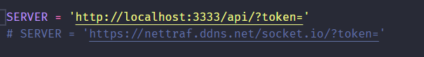

# NETTRAF

Como executar o ambiente de desenvolvimento NETTRAF

## BACK-END

Usando NestJs e prisma, devemos instalar os pacotes, realizar as migrations e iniciar o serviço.

Obs.: Deve haver um banco de dados postgres configurado na sua máquina (utilize o docker-compose.yml para isso ;))

```bash
cp env_example .env
npm i
npx prisma migrate dev # executar migrations
npm run start:dev

```

Com esses comandos, temos o Back-end operando.


## FRONT-END

Para utilizar o Angular basta seguir os passos:

```bash
cd env_example .env
npm i
npm i -g ts-node
npm run start
```


## DESKTOP

Utilizamos pipenv para gerenciar nossos pacotes.

```
pip install pipenv
cd windows-installer
pipenv install
pipenv shell
```

Altere o arquivo `src/NETTRAF.py` para apontar para o ambiente de desenvolvimento.



Execute o script:

```
python src\NETTRAF.py
```
